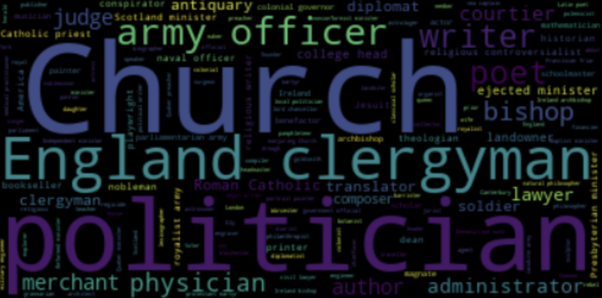

# nlp-wordcloud
What are the common words used to discribe individuals historical 
significance? lets make a wordcloud. source (csv file from specific 
columns)

(notebook copied with edit from 
Rachael Tatman) kaggle.com/rtatman/notebooks

