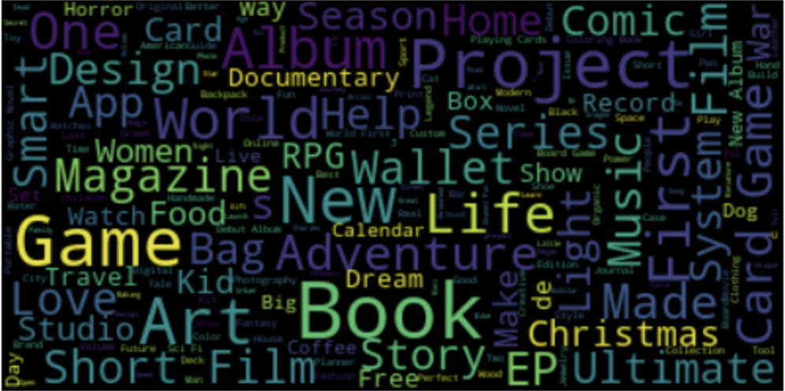

# nlp-wordcloud

# Project Overview
This project aims to generate a wordcloud visualization based on a CSV 
file containing descriptions of title. By analyzing the text data, the project extracts the most common words used 
to describe these titles and presents them in a visually appealing 
simple wordcloud format

# Results

